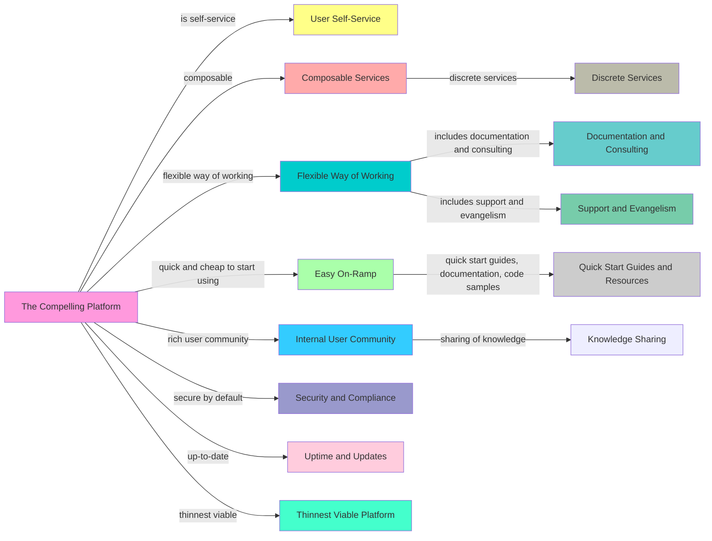

```bash
curl -s https://blog.eformat.me/2022/11/the-compelling-platform.html | jbang run fabric.java -p create_mermaid_visualization_for_github -s
```




VISUAL EXPLANATION:
- Visualizes the Compelling Platform and its key features as a diagram.
- Uses arrows to represent relationships between platform attributes.
- Color-coding used for different categories of platform characteristics.
- A clear, concise representation of the concept, easy to follow and understand.

